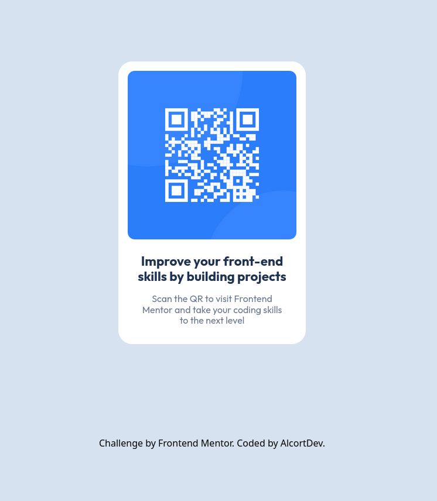

# Frontend Mentor - QR code component solution

This is a solution to the [QR code component challenge on Frontend Mentor](https://www.frontendmentor.io/challenges/qr-code-component-iux_sIO_H). Frontend Mentor challenges help you improve your coding skills by building realistic projects. 

## Table of contents

- [Overview](#overview)
  - [Screenshot](#screenshot)
  - [Links](#links)
- [My process](#my-process)
  - [Built with](#built-with)
  - [What I learned](#what-i-learned)
- [Author](#author)

**Note: Delete this note and update the table of contents based on what sections you keep.**

## Overview
This proyect is my comeback to frontend programing, i know its pretty simple, but i guess we all start somewhere...
### Screenshot



### Links

- Solution URL: (https://your-solution-url.com)
- Live Site URL: (https://qr-component-liard.vercel.app/)

## My process

### Built with

- Semantic HTML5 markup
- Tailwindcss v.4 (Using the CLI installation method)
- Tailwindcss custom properties
- CSS custom properties
- Flexbox
- Mobile-first workflow
- [Tailwind](https://tailwindcss.com/) - Tailwindcss official page


### What I learned

it's been a long time since i don't code anything to frontend, so... i'm a little bit rusty. I wanted to come back and actualy start coding some stuff and trying new technologies i wasn't familiar with.

I did strugle a bit trying to set it up for the first time, but i found my way at the end.

i loved learning how to use this custom properties, i think is pretty easy to understand and once you get used to them, they become practicaly something you are going to use 100% of the time

```css
@theme{
    --breakpoint-mobile: 375px;
    --breakpoint-pc:1024px;
    
    --color-White: hsl(0, 0%, 100%);
    --color-Slate-300: hsl(212, 45%, 89%);
    --color-Slate-500: hsl(216, 15%, 48%);
    --color-Slate-900: hsl(218, 44%, 22%);

}


- Frontend Mentor - [@AlcortDev](https://www.frontendmentor.io/profile/AlcortDev)
